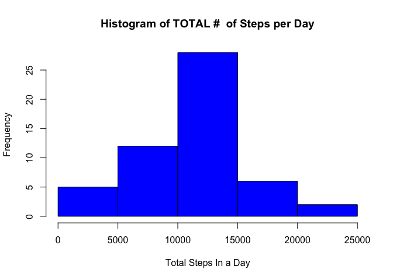
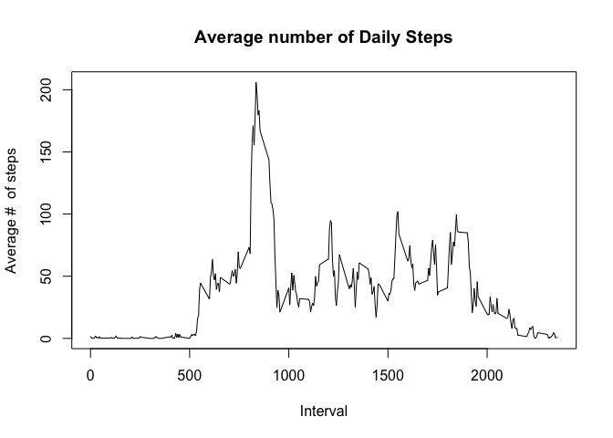
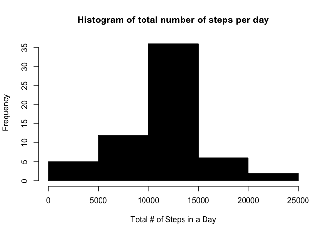
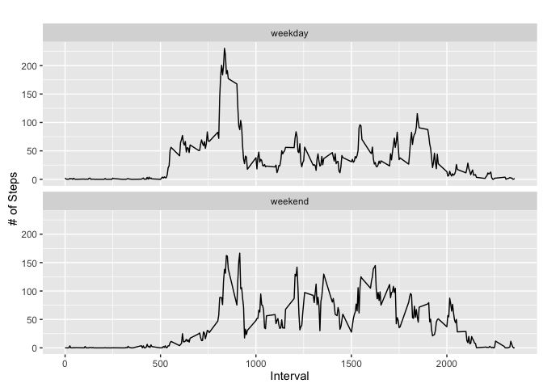

# Reproducible Research: Peer Assessment 1
Shawn Kercher  


## Loading and preprocessing the data
Show any code that is needed to

1. Load the data (i.e. read.csv()).

2. Process/transform the data (if necessary) into a format suitable for your analysis.
	

```r
zipFile <- "activity.zip"
fileName <- "activity.csv"

if(!file.exists(fileName)){	
	unzip(zipFile)
}

# read csv into dataset
dataFrame <- read.csv(fileName, as.is=TRUE)
```


## What is mean total number of steps taken per day?
For this part of the assignment, you can ignore the missing values in the dataset.

1.  Make a histogram of the total number of steps taken each day

2.  Calculate and report the mean and median total number of steps taken per day


```r
# omit all NA
dataFrame2 <- na.omit(dataFrame)


# aggregate steps per day
tableSteps <- aggregate(steps ~ date, dataFrame2 , sum)

# create histogram for Total Setps in a day
hist(tableSteps$steps,xlab = "Total Steps In a Day", main = "Histogram of TOTAL #  of Steps per Day", col=4)
```

\

```r
# mean steps
mean(tableSteps$steps,na.rm = TRUE)
```

```
## [1] 10766.19
```

```r
# median steps
median(tableSteps$steps,na.rm = TRUE)
```

```
## [1] 10765
```

## What is the average daily activity pattern?
1. Make a time series plot (i.e. type = "l") of the 5-minute interval (x-axis) and the average number of steps taken, averaged across all days (y-axis)

2. Which 5-minute interval, on average across all the days in the dataset, contains the maximum number of steps?


```r
# aggregate steps per interval
tableIntervalSteps <- aggregate(steps ~ interval, dataFrame2, mean)

# create plot steps per interval
plot(tableIntervalSteps$interval,tableIntervalSteps$steps,type="l",col=1,main="Average number of Daily Steps", xlab = "Interval", ylab = "Average #  of steps")
```

\

```r
# max average steps interval
maxAverageStepsInterval <- which.max(tableIntervalSteps$steps)

# table max interval steps
tableIntervalSteps[maxAverageStepsInterval,]
```

```
##     interval    steps
## 104      835 206.1698
```


## Imputing missing values
1. Calculate and report the total number of missing values in the dataset
(i.e. the total number of rows with NAs)

2. Devise a strategy for filling in all of the missing values in the dataset. The strategy does not need to be sophisticated. For example, you could use the mean/median for that day, or the mean for that 5-minute interval, etc.

3. Create a new dataset that is equal to the original dataset but with the missing data filled in.

4. Make a histogram of the total number of steps taken each day and Calculate and report the mean and median total number of steps taken per day. Do these values differ from the estimates from the first part of the assignment? What is the impact of imputing missing data on the estimates of the total daily number of steps?

```r
# missing data NA
dataFrameNA <- dataFrame[!complete.cases(dataFrame),]

# num of rows
nrow(dataFrameNA)
```

```
## [1] 2304
```

```r
# perform imputation 
for(i in 1:nrow(dataFrame)){
        if(is.na(dataFrame$steps[i])){
                intervalVal <- dataFrame$interval[i]
                rowId <- which(tableIntervalSteps$interval == intervalVal)
                stepsVal <- tableIntervalSteps$steps[rowId]
                dataFrame$steps[i] <- stepsVal
        }
}

# aggregate steps per date to get total steps in day
tableDateStepsImpute <- aggregate(steps ~ date, dataFrame, sum)

# create histogram of total number of steps in a day
hist(tableDateStepsImpute$steps, col=1, main="Histogram of total number of steps per day", xlab = "Total # of Steps in a Day")
```

\

```r
# mean of total # steps per day
mean(tableDateStepsImpute$steps)
```

```
## [1] 10766.19
```

```r
# median of total # steps per day
median(tableDateStepsImpute$steps)
```

```
## [1] 10766.19
```


## Are there differences in activity patterns between weekdays and weekends?
1. Create a new factor variable in the dataset with two levels – “weekday” and “weekend” indicating whether a given date is a weekday or weekend day.

2. Make a panel plot containing a time series plot (i.e. type = "l") of the 5-minute interval (x-axis) and the average number of steps taken, averaged across all weekday days or weekend days (y-axis). The plot should look something like the following, which was creating using simulated data:

```r
# convert date to date class
dataFrame$date <- as.Date(dataFrame$date, "%Y-%m-%d")

# add column of day of week
dataFrame$day <- weekdays(dataFrame$date)

# add column called weekday
dataFrame$dayType <- c("weekday")

for(i in 1:nrow(dataFrame)){
        if(dataFrame$day[i] == "Saturday" || dataFrame$day[i] == "Sunday"){
                dataFrame$dayType[i] <- "weekend"
        }
}

# convert day time
dataFrame$dayType <- as.factor(dataFrame$dayType)

# aggregate steps as interval to get average number of steps in interval across all days
tableIntervalStepsImputed <- aggregate(steps ~ interval + dayType, dataFrame, mean)

# create plot
library(ggplot2)
```

```
## Warning: package 'ggplot2' was built under R version 3.2.3
```

```r
qplot(interval, steps, data=tableIntervalStepsImputed, geom=c("line"), xlab = "Interval", ylab = "# of Steps", main = "") + facet_wrap(~ dayType, ncol = 1)
```

\
